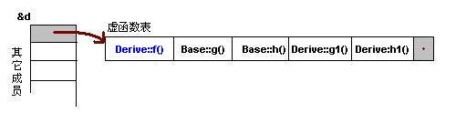
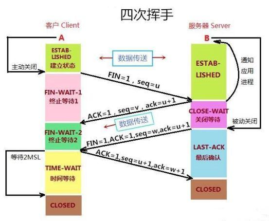

[TOC]

# C/C++复习


## C++

### 字节对齐

#### 定义

​	现代计算机中内存都是按照byte划分，实际情况是访问特定类型变量的时候经常在特定的内存地址访问，这就需要各种类型数据按照**一定的规则**排列，而不是顺序的一个接一个排放，这就是对其

#### 对齐的原因和作用

​	有些架构的CPU在访问一个没有进行对齐的变量时会发生错误，那么在这种架构中必须保证字节对齐。最主要的原因因为**存取效率**，如果没有对齐，一个Int可能需要两个周期才能拼凑读出。

### static

#### static被用来控制变量的**存储方式**和**可见性**

1. 在函数内部定义变量时，当程序执行到定义处时，编译器为它在**栈**中分配空间，函数在栈上分配的空间在执行完函数后释放掉。static关键字解决保存变量，并保护了此变量的访问范围。C++中，static数据对象为**整个类**服务而非某个对象服务。
2. **全局（静态）存储区**：分为**DATA**段（全局初始化区）和**BSS**段（全局未初始化区）。存储在这个区的变量在程序运行结束时自动释放。其中**BSS**段在程序执行之前被系统自动清0。存储在静态数据区的变量会在**程序刚开始运行时就完成初始化**，也是**唯一**的一次初始化
3. 空间分配有三个可能的地方：类的外部接口的头文件（有类声明）；类定义的内部实现（类成员函数）；main函数前的全局数据声明，定义。
4. class内声明static int a，在class外用int Class::a来初始化。类的声明不会进行内存空间的分配。所以**类内声明，类外定义**。并且注意定义尽量不要出现在头文件中，以免造成重复定义。

#### C/C++中static的作用

1. static修饰全局变量时，这个全局变量只能在本文件中访问，即便是extern外部声明也不行。好处是其他文件可以定义重名变量。
2. static修饰函数，则这个函数只能本文件中调用。
3. 不想被释放时，可以用static修饰。
4. 考虑到安全性，若想使用全局变量，优先考虑static。

#### static用法

1. 注意：static修饰的方法，变量，实例中共享，一处变处处变。
2. `类名::变量名`引用变量，记得类外定义。
3. `类名::方法名`引用方法，已经定义好了。
4. 不能通过**类名**调用类的**非静态**成员函数，但类的**对象**可以使用**静态**成员函数和**非静态**成员函数。
5. **静态**成员函数中不能引用**非静态**成员，**非静态**成员函数可以调用用**静态**成员函数。
6. 类的**静态成员变量**必须先**初始化**再使用。


### const

#### const修饰普通类型的变量

1. 编译器会强制实施这个约束，允许程序员告诉编译器某值是保持不变的。如果在编程中确实有某个值保持不变，就应该明确const。
2. `const int a = 7`，可以`int b = a`，不可以`a = 8`
3. 加了`volatile`关键字后可以更改

#### const修饰指针变量

1. const修饰指针指向的内容，则内容为不可变量。`const int *p = 8;`
2. const修饰指针，则指针为不可变量。`int* const p = &a;`
3. const修饰指针和指针指向的内容，则两者都为不可变量。`const int * const p = &a;`

#### const参数传递和函数返回值

1. 一般`void fun(const int a)`是不需要const的，因为函数会自动产生临时变量复制实参值。
2. `void fun(int *const a)`可以防止指针被意外篡改。
3. 自定义类型参数传递，因为需要临时对象复制参数，调用其构造函数，比较浪费时间，所以可选择`void fun(const Class& c)`节约时间。

#### 其他

1. 同时定义两个函数，一个const，一个不带，本质上是函数重载。`int func()const{}`
2. const不能和static一起用。因为static修饰静态成员函数，静态成员函数不含有this指针，即不能实例化，const成员函数必须具体到某一实例。
3. const成员函数保证函数内成员不做更改，除非成员用`mutable`修饰。

### 指针

#### 指针和引用

1. 所有指针的大小是固定的，代表内存地址的长度。32位4字节，64位8字节

2. 引用是一个变量的别名，引入了对象的一个同义词。`&b = a`

3. | 指针有自己的空间                         | 引用只是一个别名                           |
   | ---------------------------------------- | ------------------------------------------ |
   | sizeof指针是4/8                          | sizeof引用是引用的大小                     |
   | 指针可以初始化为NULL                     | 引用必须被初始化且必须是一个已有对象的引用 |
   | 作为参数传递时，需要解引用才能对对象操作 | 对引用的修改会改变引用所指向的对象         |
   | 可以有const指针                          | 没有const引用                              |
   | 指针可以指向其他对象                     | 引用只能是一个对象的引用                   |
   | 指针可以多级                             | 引用只有一级                               |
   | 指针++是指针向后偏移一个类型的大小       | 引用++是实体+1                             |

   

#### 指针和数组

| 指针                                                       | 数组                         |
| ---------------------------------------------------------- | ---------------------------- |
| 保存数据的地址                                             | 保存数据                     |
| 间接访问数据。首先得到指针内容，以其为地址，从地址得到数据 | 直接访问数据                 |
| 动态数据结构                                               | 固定数目且数据类型相同的元素 |
| Malloc\new分配，free\delete释放                            | 隐式的分配和删除             |
| 通常指向匿名数据，操作匿名函数                             | 自身即为数据名               |

数组是分配在栈上的

char*p = "hello"这是char指针指向常量字符串“world”,不可以`p[0]`这样修改。

#### 指针函数和函数指针

**指针函数**：本质是函数，返回值是一个指针`ret *func(args,...)`其中`ret*`作为整体，是返回值

在指针函数中，若返回值是指向一个函数内局部变量时，把这个变量改为**static**，因为函数在结束时会把局部变量从栈中释放掉，此时指针指向那个变量的地址可能保存了其他东西，或者因此访问一些不可访问的内容，造成崩溃。

**函数指针**：本质是一个指针，指向了一个函数。函数指针指向代码段中函数入口地址的指针。`ret(*p)(args,...)`其中`ret`为返回值。函数名即是该函数的函数指针。

```c++
#include <stdio.h>

int max(int a, int b)
{
    return a > b ? a : b;
}

int main(void)
{
    int (*p)(int, int); //函数指针的定义
    //int (*p)();       //函数指针的另一种定义方式，不过不建议使用
    //int (*p)(int a, int b);   //也可以使用这种方式定义函数指针
    
    p = max;    //函数指针初始化

    int ret = p(10, 15);    //函数指针的调用
    //int ret = (*max)(10,15);
    //int ret = (*p)(10,15);
    //以上两种写法与第一种写法是等价的，不过建议使用第一种方式
    printf("max = %d \n", ret);
    return 0;
}
原文链接：https://blog.csdn.net/u010280075/article/details/88914424
```

**使用场景**：有很多排序，只要在函数指针初始化时改，就可以完成排序的选择。回调函数中也会使用`int callback(int n,int(*p)(int))`

#### 空指针

字面值0表示空指针，NULL是表示空指针的C语言宏（C++98），在C++11中使用nullptr，也可以用0

#### 野指针

1. 指针变量没有初始化。`char*p`会乱指，是随机的。

2. 在delete指针后要将其设置为null，否则是野指针。

3. 指针操作超越了变量的作用范围，也会是野指针。`char*p = new char[10]`，访问`*(p+10)`

4. ```c++
   #include<iostream>
   using namespace std;
   void main()
   {
       char *p=new char[3];  //分配三个字符空间，p指向该内存空间
       p="ab";             //此时p指向常量“ab”,而不再是new char分配的内存空间了，从而造成了资源泄漏
       delete []p;         //释放时报错
   }
   ```

   p指向常量"ab"，而不是在分配的空间内写ab，释放时会卡死。应该使用`strcpy(p,"ab")`

#### 智能指针

1. 四种智能指针

   - 智能指针主要用于管理在堆上分配的内存，它将普通的指针封装成一个栈对象。

   - auto_ptr：c++98中使用，c++11被弃用

   - unique_ptr：实现独占式拥有或严格拥有概念。保证同一时间内只有一个智能指针可以指向该对象。它对于避免资源泄露特别有用。

     ```c++
     unique_ptr<string> p3 (new string ("auto"));
     unique_ptr<string> p4;
     p4 = p3;//此时会报错
     //但是将unique_ptr赋值给另一个时，如果源unique_ptr是个临时右值，编译器允许这么做。
     unique_ptr<string> pu3;
     pu3 = unique_ptr<string> (new string("you"));
     //这是允许的
     ```

     若在第一个例子中，实在想给p4赋值p3，可以用std::move`p4 = move(p3);`

   - shared_ptr：实现共享式拥有概念。多个智能指针可以指向同对象。该对象和相关资源会在“最后一个引用被销毁“时释放。通过成员函数`use_couunt()`来查看资源的所有者个数。当我们调用`release()`时，当前指针会释放资源所有权，计数减一。当计数等于0时，资源会被释放。

   - weak_ptr：是一种不控制对象声明周期的智能指针，它指向一个shared_ptr管理的对象。weak_ptr只是提供了对管理对象的一个访问手段。weak_ptr设计的目的是为配合shared_ptr而引入的一种智能指针来协助shared_ptr工作。它**只可以**从shared_ptr或另一个weak_ptr对象构造，它的构造和析构不会引起引用计数的增加或减少。

2. 智能指针的内存泄漏问题 valgrind可以检查

   shared_ptr引发的”死锁“问题及weak_ptr解决方案

   ```c++
   class Person {
     public:
       string name;
       shared_ptr<Person> mother;
       shared_ptr<Person> father;
       vector<weak_ptr<Person>> kids;  // weak pointer !!!
   
       Person (const string& n,
               shared_ptr<Person> m = nullptr,
               shared_ptr<Person> f = nullptr)
        : name(n), mother(m), father(f) {
       }
   
       ~Person() {
         cout << "delete " << name << endl;
       }
   };
   
   shared_ptr<Person> initFamily (const string& name)
   {
       shared_ptr<Person> mom(new Person(name+"'s mom"));
       shared_ptr<Person> dad(new Person(name+"'s dad"));
       shared_ptr<Person> kid(new Person(name,mom,dad));
       weak_ptr<Person> wkid(kid);
       mom->kids.push_back(wkid);
       dad->kids.push_back(wkid);
       return kid;
   }
   
   int main()
   {
       shared_ptr<Person> p = initFamily("nico");
   
       cout << "nico's family exists" << endl;
       cout << "- nico is shared " << p.use_count() << " times" << endl;
       cout << "- name of 1st kid of nico's mom: "
            << p->mother->kids[0].lock()->name << endl;
       return 0;
   }
   原文链接：https://blog.csdn.net/ktigerhero3/article/details/80117359
   ```


### 类型转换

#### 隐式类型转换

- 对于内置类型，低精度的变量给高精度变量赋值时会发生隐式类型转换

#### 显示类型转换

- const_cast。字面意思，去const属性。只能转换指针或者引用

  ```c++
  const int a = 10;
  int *b = const_cast<int*>(&a);
  *b = 20;
  //此时a还是10，但*b是20了
  ```

- static_cast，静态类型转换，如int转换成char。但不能进行**两个不相关类型**的转换，例如整形和整形指针（一个是数据，一个是地址）`int i = 10; double d = static_cast<double>(i)`

- dynamic_cast，动态类型转换，如子类和父类之间的多态类型转换`A *a = dynamic_cast<A*>(b);`

- reinterpret_cast，仅重新解释类型，但没有进行二进制的转换。啥都能转，不过可能出问题，尽量少用。

### 正则表达式

原文链接：https://blog.csdn.net/bgzclxqq/article/details/90262904

#### 具有特殊意义的元字符

`\`：`\字符`可以改变`字符`原本的含义

`^`：`^字符`表示字符串的头，且要求字符串以`字符`开头，不占位。`\^`表示真正的'^'

`$`：`$字符`指示字符串的尾，且要求字符串以`字符`结尾，不占位。`\$`表示一个真正的$符号。

`()`：分组，大正则中包含小正则。可以改变默认的优先级。在模式中可以使用`\1`来表示第一组已然捕获到的东西。

`\b`：指示字符串的边界（头/尾/空格左/空格右），`字符\b`要求边界的左边是`字符`，`\b字符`要求边界的右边是`字符`。

`.`：表示一个除了`\n`以外的任意一个字符。`\.`表示一个真正的.符号。

`|`：`字符串1|字符串2`表示**一个**字符串，该字符串是字符串1、字符串2中的一个。`|`在正则中的优先级比较混乱，所以建议加上足够多的括号来分组。

`[]`：`[字符1字符2字符3...]`表示一个字符，该字符是字符1、字符2、字符3……中的某一个。中括号中出现的所有字符都是代表本身意思的字符（没有特殊含义），如`[.]`只能匹配`.`符号，而不能匹配任意符号。

`[^字符1字符2字符3...]`表示一个字符，该字符不是字符1、字符2、字符3……中的任何一个

`[a-z]`表示一个字符，该字符是a、b、c……z中的某一个

`[^a-z]`表示一个字符，该字符不是a、b、c……z中的任何一个

`\w`：表示一个字符，该字符是数字、字母、下划线中的任何一个。等价于`[(0-9)(a-z)(A-Z)(_)]`

`\W`：表示一个字符，该字符不是数字、字母、下划线中的任何一个。等价于[]

`\d`表示一个字符，该字符是0、1、2……9中的某一个

`\D`表示一个字符，该字符不是0、1、2……9中的任何一个

`\s`表示一个字符，该字符是空白符（空格、制表符、换页符）2、代表出现次数的

#### 量词元字符

`*`：`字符*`要求`字符`出现0到多次

`+`：`字符+`要求`字符`出现1到多次

`?`：`字符?`要求`字符`出现0次或1次

`{n}`：`字符{n}`要求`字符`出现n次

`{n,}`：`字符{n,}`要求`字符`出现n到多次

`{n,m}`：`字符{n,m}`要求`字符`出现n到m次

#### 例子

账号（字母开头，5-16字节，允许字母数字下划线）：^\[a-zA-Z][a-zA-Z0-9]{4,15}$

身份证：(^\d{18}$)|(^\d{17}([xX])$)

#### 代码

```c++
#include <regex>
regex pattern("(.{5})_(\\d{4})");	//匹配5个任意单字符 + 下划线 + 4个数字
bool match = regex_match(str,pattern);

string str = "Hello_2018";
smatch result;
regex pattern("(.{5})_(\\d{4})");	//匹配5个任意单字符 + 下划线 + 4个数字

if (regex_match(str, result, pattern))
{
	cout << result[0] << endl;		//完整匹配结果，Hello_2018
	cout << result[1] << endl;		//第一组匹配的数据，Hello
	cout << result[2] << endl;		//第二组匹配的数据，2018
	cout<<"结果显示形式2"<<endl;
	cout<< result.str() << endl;	//完整结果，Hello_2018
	cout<< result.str(1) << endl;	//第一组匹配的数据，Hello
	cout << result.str(2) << endl;	//第二组匹配的数据，2018
}

//遍历结果
for (int i = 0; i < result.size(); ++i)
{
	cout << result[i] << endl;
}
原文链接：https://blog.csdn.net/qq_34802416/article/details/79307102
```


### 重载、覆盖、重写

#### 重载(overload)

两个函数名相同，但是参数列表**不同**（个数，类型），**返回值类型没有要求**，在**同一**作用域中。virtual可有可无。

#### 覆盖(override)

覆盖的概念是用来实现多态的。即子类重新改写父类声明为virtual的函数。它们作用于子类父类，函数名字必须相同，参数列表完全相同。

#### 重写(overwrite)

也叫屏蔽，隐藏。

1. 如果子类函数和父类函数同名，但参数不同。那么无论有没有virtual，父类函数被隐藏。
2. 如果子类函数与父类函数同名，并且参数相同。若父类函数没有virtual，则父类函数被隐藏。

当前类的同名方法，方法**名字相同**，由传递给它们的不同个数的类型的参数（不同顺序也可，只不过不推荐）

### C++三大特性

#### 封装

隐藏对象的属性和实现细节，仅对外公开接口。也就是将数据和操作数据的源代码进行有机结合，形成“类”，其中数据和函数都是类的成员。

封装的目的是增强**安全性**和**简化**编程，使用者不用了解具体实现细节，只要通过外部接口，以特定的访问权限来使用类的成员。

#### 继承

继承就是子类继承父类的特征和行为。抽取**共有**特性和方法形成高一层的类

C++中

1. 公有继承中父类的`public,protected`在子类中不变，`private`在子类中不可访问。
2. 私有继承中父类的`public,protected`在子类中变为私有，`private`在子类中不可访问。
3. 保护继承中父类的`public,protected`在子类中变为保护，`private`在子类中不可访问。

#### 多态

所谓多态就是一个类实例的相同方法在不同情形有不同的表现形式。多态三个必要条件**继承，重写，父类引用指向子类对象**

#### 五大原则

1. 一个类应该有且仅有一个去改变它的理由，这意味着一个类应该只有一项工作。
2. 对象或实体应该对扩展开放，对修改封闭。
3. 对父类的调用同样适用于子类
4. 高层次的模块不应该依赖于低层次的模块，它们都应该依赖于抽象。
5. 不应该强迫客户端实现一个它用不上的接口。
6. 耦合度 = 1/（使用的参数个数，给出的参数个数，用到的全局变量个数，被用到的次数，用到别人模块的次数）

#### 虚函数(virtual)

https://blog.csdn.net/weixin_43329614/article/details/89103574

虚函数的实现由两个部分组成，**虚函数指针**和**虚函数表**

**虚函数指针**：从本质上来说就是一个指向函数的指针，与普通的指针并无区别。他指向用户所定义的虚函数，具体在子类中实现，当子类调用虚函数的时候，实际上是通过该函数指针从而找到接口。只有拥有虚函数的类才会有虚函数指针，每一个虚函数也会对应一个虚函数指针（虚函数表中）。每个类的实例化对象都会拥有虚函数指针（对象中）并且排在对象的地址首部。

`子类中的函数最好写上virtual，为了结构清晰，实际上virtual属性会被继承过来`

在得到正确继承后，被继承的虚函数指针会被覆盖，而子类自己的虚函数将跟在标后

```c++
class Base
{
    public:
    virtual void f(){cout<<"Base::f"<<endl;}
    virtual void g(){cout<<"Base::g"<<endl;}
    virtual void h(){cout<<"Base::h"<<endl;}
};
class Derived:public Base
{
	public:
    virtual void f(){cout<<"Derived::f"<<endl;}
    virtual void g1(){cout<<"Derived::g1"<<endl;}
    virtual void h1(){cout<<"Derived::h1"<<endl;}
}
原文链接：https://blog.csdn.net/weixin_43329614/article/details/89103574
```



在多继承的时候，表项增多，顺序是继承的顺序，子类自己函数在第一个表中


注：C++中一个类公用一张虚函数表，极大节省内存。

**纯虚函数**：`virtual void func() = 0;`，拥有纯虚函数的类叫做抽象类，是不允许有实例对象的。

**动态绑定**：基类指针指向派生类。访问派生类中同名覆盖（override）成员函数。当基类指针指向派生类时，实际上既可以获得派生类的虚表指针，通过虚表指针，基类即可以去调用派生类中的成员函数。

### C++和JAVA的编译

#### C++代码执行：

1. 预处理：将`#include`的头文件里的内容合并进源代码中，将`#define`的宏定义的内容进行数据替换，加载外部代码
2. 编译器(compiler)：将预处理后的文件进行编译，期间有语法分析，词法分析。cpp->obj
3. 链接器：把所有的静态链接库(.lib)和.obj链接起来，形成exe文件。
4. 运行.exe文件，并在过程中加载动态链接库(.dll)

#### JAVA代码执行：

1. .java ->编译-> .class ->加载-> JVM ->软件-> cpu
2. 期间JVM负责loading, linking, initializing。
3. 深层有interpreting和jit

## 数据结构与算法

### 红黑树


1. 每个节点是红色或者黑色
2. 根节点是黑色
3. 每个叶子节点是黑色，叶子节点是为空（NULL）的节点
4. 如果一个节点为红，那么子节点必须为黑
5. 从任一节点到叶子节点的路径包含相同数目的黑色节点

### Map

1. 底层红黑树
2. `map<string,int>myMap`
3. `map.insert(make_pair("asd",111));`或者`map.insert(pair<string,int>("asd",111))`
4. 删除单个`map.erase(key)`删除范围`map.erase(map.begin(),map.end())`
5. 不允许key重复（multimap可以重复，底层也是红黑树）

### Unordered map

1. 底层哈希表

### Set

1. 底层红黑树
2. `set<int>mySet`
3. 迭代器是const的，不允许修改元素的值

### Vector和List

| vector                                      | list                           |
| ------------------------------------------- | ------------------------------ |
| 底层是数组                                  | 底层是双向链表                 |
| 支持随机访问，O(1)                          | 不支持，随机访问O(n)           |
| 顺序内存                                    | 随机内存                       |
| 中间节点插入删除会导致内存拷贝              | 不会内存拷贝                   |
| 一次性分配好内存，不够时2倍扩容，不主动缩容 | 每次插入新节点都会进行内存申请 |
| 随机访问性能好，插入删除性能差              | 随机访问性能差，插入删除性能好 |

### B Tree和 B+ Tree

B Tree是一种多路自平衡搜索树，示意图如下


B Tree的特点：

1. 所有键值分布在整个树中
2. 任何关键字出现且出现在一个节点中
3. 搜索有可能在非叶子节点结束
4. 在关键字全集内做一次查找，性能逼近二分查找

B+ tree和B-tree类似


B+ tree的特点：

1. 所有关键字存储在叶子结点，非叶子节点不存储真正的data
2. 为所有叶子节点增加了一个链指针

红黑树也可以作为索引，但是B、B+树一般用于mysql等基于磁盘的数据库，会涉及到磁盘IO，所以要尽可能的避免磁盘IO（比内存IO消耗高太多了）。

### 迭代器iterator

迭代器模式是运用于聚合对象的一种模式，通过运用该模式，使得我们可以在不知道对象内部表示的情况下，按照一定顺序，去访问聚合对象中的各个元素。

迭代器不是指针，是类模板，只不过表现得像指针。迭代器返回的是对象引用，而不是对象的值。

用迭代器而不是指针是为了把不同集合类的**访问逻辑**抽象出来，使得不用暴露集合内部的结构而达到循环遍历集合的效果。


## 数据库

### 数据库索引

索引是对数据库表中一列或多列的值进行排序的一种结构，使用索引可以快速访问数据库表中的特定信息。索引的主要目的就是加快检索表中数据。

**优点**：

1. 通过创建唯一性索引，可以保证数据库表中每一行数据的唯一性。
2. **可以大大加快数据的检索速度**
3. 加快表与表之间的连接(join)，特别实在实现数据的参考完整性方面特别有意义。
4. 在使用分组和排序字句进行数据检索时，同样可以显著减少查询中分组和排序的时间。
5. 通过使用索引，可以在查询的过程中，使用优化隐藏器，提高系统的性能。

**缺点**：

1. 创建索引和维护索引需要耗时，这种时间随着数据量的增加而增加。
2. 索引需要占用物理空间，除了数据表占据数据空间之外，每一个索引还要占一定的物理空间。
3. 对表中数据进行增删改的时候，索引也需要动态的维护。

### 主键外键

主键：能确定一条记录的唯一表示。表为（学号，姓名，性别，班级）则学号为主键

外键：用于与另一张表关联。是能确定另一张表记录的字段，用于保证数据的一致性。另一表为（学号，课程号，成绩）则**学号**为外键，**学号+课程号**为主键

外键作用：保持数据一致性，完整性，主要目的是控制存储在外键表中的数据。

### 三大范式

**第一范式**：列不可再分。每一列属性都是不可再分的属性值，确保每一列的原子性

**第二范式**：属性完全依赖于主键。每行都必须可以被唯一地区分。为实现区分，通常需要一列属性—主键

**第三范式**：属性不依赖于其它非主属性   属性直接依赖于主键。

对于一个Student表（学号，姓名，年龄，所在院校，院校地址，院校电话）

就可以把它拆开来（学号，姓名，年龄，所在院校）--（所在院校，院校地址，院校电话）

### 数据库事务以及四个特性

事务(Transaction)是由一系列对系统中数据进行访问与更新的操作所组成的一个程序执行逻辑单元。事务是DBMS中最基础的单位，事务不可分割。

1. 原子性：原子性指事务包含的所有操作要么全部成功，要么全部失败回滚
2. 一致性：事务必须使数据库从一个一致性状态变换到另一个一致性状态。AB两者钱加起来5000，不管AB怎么转账，事务结束后两个用户的钱加起来必须为5000
3. 隔离性：多个用户并发访问数据库时，比如操作同一张表时，数据库为每一个用户开启的事务，不能被其他事务的操作干扰，多个并发事务之间要互相隔离。
   1. 读取未提交：最低的隔离级别，什么都不需要做，一个事务可以读到另一个事务未提交的结果。
   2. 读取提交内容：事务提交后，其更新结果才被其他事务看见。解决脏读问题。
   3. 可重复读：在一个事务中，对于同一份数据的读取结果总是相同的，无论是否其他事务对这份数据进行操作，以及这个事务是否提交。可解决脏读，不可重复读。
   4. 可串行化：事务串行化执行，隔离级别最高。
4. 持久性：事务一旦提交，则对数据库的改变是永久的。


## 计算机网络

### 计算机网络五层模型

1. 应用层：规定应用程序的数据格式。
   1. HTTP
   2. DNS
   3. SMTP
2. 传输层：利用端口把传到IP上的数据包发送给特定应用程序
   1. TCP
   2. UDP
3. 网络层：判断MAC地址是否处于同一子网。
   1. IP协议：通过子码掩码判断网络部分（其余为主机部分）
   2. ARP
   3. ICMP：
4. 链路层：
   1. 以太网协议：一组电信号构成一个数据包，称为“帧”。每一帧由**Head**和**Data**组成。
   2. MAC：网卡接口，每一个网卡都会有一个地址，唯一标识。
   3. ARP协议（网络层）：广播，A向子网所有MAC地址发送这个数据包，当计算机B发现这个包的MAC地址和自己的一样，才接收。
5. 物理层：把两台计算机连起来（光纤，电缆），然后计算机传1,0

### TCP与UDP

#### 三次握手与四次挥手




TIME_WAIT一般为2MSL（Maximum Segment Lifetime报文最大生存时间）。2MSL = 发送过去的ACK消息最大存活时间（MSL） + 接受到FIN消息的最大存活时间（MSL）。

#### TCP的可靠性

1. 序列号、确认应答、超时重传：
   1. 数据到达接收方，接收方需要给出一个确认应答，表示已经收到该数据段，并且确认序号会说明它下一次需要接收的数据序列号。
   2. 如果发送方迟迟未收到确认应答，那么可能是发送数据丢失，也可能确认应答丢失，这时发送方在等待一定时间后进行重传。一般超时是2RTT（Rountd-Trip Time）+偏差值
2. 窗口控制与高速重发控制、快速重传：
   1. TCP会利用窗口控制来提高传输速度，意思是一个窗口大小内，不用一定要等到应答才能发送下一段数据，窗口大小就是无需等待确认而可以发送数据的最大值。
   2. 使用窗口控制，如果数据段1001-2000丢失，后面数据每次传输，确认应答都会不停地发送序号为1001的应答，表示我需要1001的数据，发送端如果收到**3次**相同应答，就会立刻进行重发。（若应答丢失，不会重发，因为如果发送数据段丢失，接收端一定会提醒）
3. 拥塞控制：
   1. 慢启动：发送方维持一个拥塞窗口。主机开始发送数据时先把拥塞窗口的大小设为1，试探网络的拥塞情况，再以指数上升。
   2. 拥塞控制：当拥塞窗口大小大于门限时，转用拥塞控制算法，每经过一个RTT就把发送方的拥塞窗口加1.此时拥塞窗口增长速率缓慢。
   3. 只要发现网络出现拥塞（没有收到确认），就把**慢开始门限**设置为**出现拥塞**时发送窗口值得一半（不小于2），然后拥塞窗口重新设为1，再次慢启动。
   4. 快重传：接收方每收到一个失序报文段后立即发出重复确认（为的是使发送方尽早知道有报文段没有到达对方）。收到**3次**重复确认应立刻重传对方尚未收到的报文段。
   5. 快恢复：当发送方连续收到三个重复确认，就执行“乘法缩小”，把慢开始门限减半。但**不执行慢启动算法**。此时拥塞窗口设置为**门限减半**的数值，再+1增长。

#### TCP、UDP的区别

|              | UDP                                | TCP                              |
| ------------ | ---------------------------------- | -------------------------------- |
| 是否连接     | 无连接                             | 面向连接                         |
| 是否可靠     | 不可靠传输，不适用流量、拥塞控制   | 可靠传输，使用流量控制和拥塞控制 |
| 连接对象个数 | 支持一对一，一对多，多对一和多对多 | 只能一对一通信                   |
| 传输方式     | 面向报文                           | 面向字节流                       |
| 首部开销     | 首部开销小，8字节                  | 首部20~60字节                    |
| 使用场景     | IP电话，直播                       | 文件，文字传输                   |

**使得UDP可靠**：RUDP，RTP，UDT

RUDP提供了一组数据服务质量增强机制，如拥塞控制的改进，重发机制的淡化服务器算法。从而在包丢失和网络拥塞的情况下，RTP客户机（实时位置）面前呈现的就是一个高质量的RTP流。在不干扰协议的实时特性的同时，可靠UDP的拥塞控制机制允许TCP方式下的流控制行为。

QUIC(Quick UDP Internet Connection)是谷歌制定的一种基于UDP的低时延的互联网传输层协议。

**UDP的检验和**：UDP首部有四个部分，源端口号，目的端口号，长度（首部+数据），检验和。其中检验和为前三项，3个16bits的加法，溢出则回卷到末尾。**取反**后得到检验和。


最长60字节的header(体现在4位首部长度里)


8字节的header，都是2字节。源端口，目的端口，长度，检验和

### HTTP和HTTPs

#### HTTP建立连接

1. TCP通过三次握手建立双方连接
2. 客户端通过发送请求报文及请求数据给服务端
3. 服务端返回响应报文及响应数据给客户端
4. TCP通过四次挥手进行断开连接。

#### HTTP1.0,1.1,2

**HTTP1.0和HTTP1.1**：

1. 长连接：HTTP1.1支持长连接和请求流水线处理，在一个TCP连接上可以传多个HTTP请求和响应。HTTP1.1中默认开启长连接keep-alive，一定程度弥补了HTTP1.0每次请求都要创建连接的缺点。
2. HTTP1.1比起1.0支持断点续传。


1. 在HTTP2中，允许了多路复用。一个TCP连接中可以发起**多重请求-响应消息**
2. 2.0比1.0多了头部压缩。1.1中HTTP请求和响应都是由**状态行、请求/响应头部、消息主体三部分**组成。


#### HTTP和HTTPS的不同

|      | HTTP         | HTTPS                                                    |
| ---- | ------------ | -------------------------------------------------------- |
| 传输 | 明文方式传输 | TLS加密传输                                              |
| 连接 | TCP三次握手  | TCP三从握手阶段后还要SSL握手，协商加密使用的对称加密秘钥 |
| 端口 | 80           | 443                                                      |
| 证书 | 无           | HTTPS协议需要服务端申请证书，浏览器端安装对应根证书。    |

#### HTTP返回码

1xx：指示信息--表示请求已接收，继续处理。

2xx：成功--表示请求已被成功接收、理解。

3xx：重定向--要完成请求必须进行更进一步的操作。

4xx：客户端错误--请求有语法错误或无法实现。

5xx：服务器端错误--服务器未能实现合法请求。

#### HTTP方法

HTTP请求报文：一个HTTP请求报文由4个部分组成：请求行，请求头部，空行，请求数据。

请求行包括：请求方法字段、URL字段、HTTP协议版本字段

若方法是POST，则请求数据这一块放置要提交的数据。

1. **GET**：最常用的方法，通常用于请求服务器发送某个资源。
2. **HEAD**：服务器在响应中只返回首部，不会返回主体部分。（判断资源类型）
3. **PUT**：向服务器写入文档。替换已存在的URL
4. **POST**：用来支持HTML的表单。表单中填好的数据通常会被送给服务器，然后由服务器将其发送到它要去的地方。
5. **trace**：客户端发起一个请求时，这个请求可能穿过防火墙，网管或其他应用程序，可能会修改原始HTTP请求。**TRACE**使得客户端可以得到请求发给服务器时最终的样子。
6. **DELETE**：请服务器删除请求URL所指定的资源。但客户端应用程序无法保证删除操作一定会被执行。

|          | GET                                   | POST                                  |
| -------- | ------------------------------------- | ------------------------------------- |
| 参数     | url传递                               | 放在request body中                    |
| 参数长度 | url中传递的参数是有长度限制的         | post没有                              |
| 安全性   | 直接暴露在url中                       | 更加安全                              |
| 编码     | 只能进行url编码                       | 支持多种编码方式                      |
| 保留     | 请求参数会被完整保留在浏览历史记录里  | 参数不会保留                          |
| 本质     | TCP链接                               | TCP链接                               |
| 数据包   | 一个数据包                            | 两个数据包                            |
|          | 浏览器把http header和data一并发送出去 | 先发header，等服务器响应100，再发data |

#### HTTP报文


### IP

#### IP分片

**MTU**：最大传输单元。这个字段的意思是拆分后的数据报的长度不能超过这个值，对于以太网来说，这个字段的值是1500字节。

**分片偏移**：以8字节为单位。

*//找书，我记得每个片都有header*

#### IP报文


版本：占4个Bit，4位ipv4

头长度：最大1111，表示15字节

总长度：一般1500字节以上就会切片

标识：用于分辨是不是同一ip的（切片拼起来用）

标志：MF（1后面还有分片，0没有）DF（0表示可以分片）

#### IP和MAC地址的作用

MAC地址是一个硬件地址，用来定义网络设备的位置，主要是链路层负责。

IP地址是IP协议提供的一种统一的地址格式，为互联网上的每一个网络和每一台主机分配一个逻辑地址，以此来屏蔽物理地址的差异。

### 搜索baidu，会用到计算机网络中什么层？

1. 浏览器中输入URL(Uniform Resource Locator)

2. DNS协议把域名解析为IP地址

   1. 主机会查询DNS缓存，如果没有则向本地DNS发送查询请求。

   2. DNS查询分为两种（递归，迭代）

   3. DNS为什么用UDP

      1. TCP协议的DNS浪费网络资源。
      2. DNS数据包不是大数据包，UDP丢了就全丢等下一次收，不用考虑丢包问题。
   
      
   
   4. DNS查询：本地DNS服务器 -> 根域名服务器 -> 顶层服务器 -> 一级服务器 -> ...
   
   5. 得到IP地址后，浏览器与服务器建立一个http连接。
   
   6. http生成一个get请求报文，将报文传给TCP层处理，再发送到IP层，通过路由器选路。


## 操作系统

### 线程与进程

#### 线程崩溃

